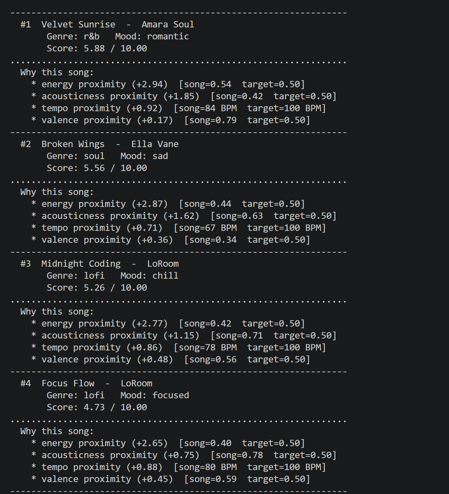
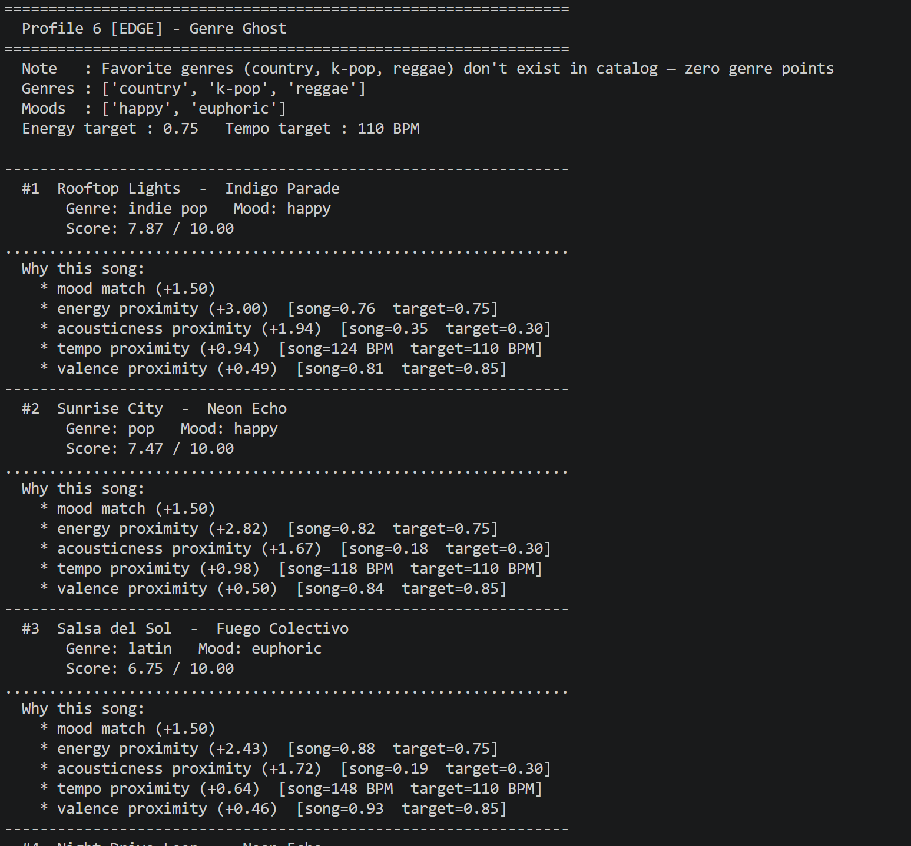

# 🎵 Music Recommender Simulation

## Project Summary

In this project you will build and explain a small music recommender system.

Your goal is to:

- Represent songs and a user "taste profile" as data
- Design a scoring rule that turns that data into recommendations
- Evaluate what your system gets right and wrong
- Reflect on how this mirrors real world AI recommenders

This project is a working CLI-first music recommender simulation. Running `python -m src.main` loads an 18-song catalog from `data/songs.csv`, scores every song against a user taste profile using a Gaussian proximity algorithm, and prints a clean ranked list of the top 5 results with point-by-point explanations directly in the terminal. Each song is scored out of 10 points across six features — genre match (+2.0), mood match (+1.5), energy proximity (up to +3.0), acousticness proximity (up to +2.0), tempo proximity (up to +1.0), and valence proximity (up to +0.5) — so every recommendation comes with a transparent, human-readable reason for why it was chosen.

---

## How The System Works

### How Real-World Recommenders Work — and What This Version Prioritizes

Real-world systems like Spotify and YouTube operate as multi-stage pipelines. In Stage 1 (Candidate Generation), approximate nearest-neighbor algorithms narrow a library of millions of songs down to a few hundred candidates in milliseconds by grouping songs into similarity neighborhoods. In Stage 2 (Scoring), each candidate receives a relevance score computed from the user's taste profile — often using Gaussian proximity across many audio dimensions simultaneously. In Stage 3 (Ranking), business logic is layered on top: diversity rules prevent the same artist from dominating the list, freshness bonuses surface new releases, and contextual signals (time of day, activity) shift feature weights in real time. This simulation focuses on **Stage 2** — the scoring engine — using a Gaussian (RBF) kernel to reward songs that land exactly on a user's preferred energy, tempo, and acousticness values, combined with binary categorical matching on mood and genre. The ranking stage is kept simple (top-N by score) so the scoring logic stays transparent and easy to inspect.

---


### Song Features

Each `Song` object stores the following attributes drawn directly from `songs.csv`:

| Feature | Type | Role in scoring |
|---|---|---|
| `genre` | string | Binary match against `favorite_genres` list (weight **0.20**) |
| `mood` | string | Binary match against `favorite_moods` list (weight **0.15**) |
| `energy` | float 0–1 | Gaussian proximity to `target_energy` (weight **0.30**) |
| `acousticness` | float 0–1 | Gaussian proximity to `target_acousticness` (weight **0.20**) |
| `tempo_bpm` | integer | Gaussian proximity to `target_tempo` after ÷200 normalization (weight **0.10**) |
| `valence` | float 0–1 | Gaussian proximity to `target_valence` (weight **0.05**) |
| `danceability` | float 0–1 | Loaded but not scored — reserved for future experiments |

### UserProfile Features

Each `UserProfile` object stores:

| Field | Type | Purpose |
|---|---|---|
| `favorite_genres` | list of strings | Genres the user prefers; binary 1.0 match, else 0.0 |
| `favorite_moods` | list of strings | Moods the user prefers; binary 1.0 match, else 0.0 |
| `target_energy` | float 0–1 | Center (μ) of the Gaussian for energy |
| `target_tempo` | float BPM | Center (μ) for tempo; normalized to 0–1 before scoring |
| `target_acousticness` | float 0–1 | Center (μ) of the Gaussian for acousticness |
| `target_valence` | float 0–1 | Center (μ) of the Gaussian for valence |
| `sigma` | float | Gaussian pickiness — default **0.20** (more forgiving than 0.15) |
| `weights` | dict | Per-feature weights; must sum to 1.0 |

---

### Algorithm Recipe (Finalized)

**Step 1 — Load catalog**
Parse `data/songs.csv` into a list of typed song dicts using `load_songs()`.

**Step 2 — For each song, call `score_song(user_prefs, song)`**

Compute six sub-scores:

```
energy_score       = gaussian(song.energy,            target_energy,            σ)
acousticness_score = gaussian(song.acousticness,       target_acousticness,      σ)
valence_score      = gaussian(song.valence,            target_valence,           σ)
tempo_score        = gaussian(song.tempo_bpm / 200,    target_tempo / 200,       σ)

genre_score        = 1.0  if song.genre in favorite_genres  else 0.0
mood_score         = 1.0  if song.mood  in favorite_moods   else 0.0
```

where `gaussian(x, μ, σ) = e ^ ( -(x − μ)² / (2σ²) )`

**Step 3 — Weighted sum**

```
total = 0.30 × energy_score
      + 0.20 × genre_score
      + 0.20 × acousticness_score
      + 0.15 × mood_score
      + 0.10 × tempo_score
      + 0.05 × valence_score
```

**Step 4 — Rank and return**
Collect `(song, total, explanation)` for all songs, sort descending by `total`, return top-k.

---

### Potential Biases to Watch For

- **Genre + acousticness dominance** — Together genre (0.20) and acousticness (0.20) account for 40% of the score. A song in the wrong genre but with a perfect acoustic texture will still outscore a genre-matched song with slightly wrong acousticness. This could surface folk or classical songs for a lofi user when the catalog expands.
- **Mood under-reward before the fix, over-reward risk now** — Raising mood from 0.05 → 0.15 means a song with a matching mood but mismatched energy (e.g., an *intense* lofi track) could still rank highly. Monitor whether mood match is pulling the wrong songs up.
- **Binary categorical cliff** — Genre and mood are all-or-nothing (1.0 or 0.0). A song with a closely related genre (e.g., `indie pop` vs `pop`) scores zero on genre regardless of how similar it actually sounds.
- **Small catalog amplifies outliers** — With only 18 songs, a single weight change visibly reshapes the entire top-5. Results will stabilize with a larger catalog.
- **No diversity enforcement** — If multiple songs share the same top-scoring genre and mood, they will all cluster at the top with no mechanism to surface variety.

---


===============================================================
  Profile 1 - High-Energy Pop
================================================================
  Note   : Standard upbeat listener: pop/indie pop, happy and intense
  Genres : ['pop', 'indie pop', 'synthwave']
  Moods  : ['happy', 'intense', 'moody']
  Energy target : 0.82   Tempo target : 124 BPM

----------------------------------------------------------------
  #1  Sunrise City  -  Neon Echo
       Genre: pop   Mood: happy
       Score: 9.99 / 10.00
................................................................
  Why this song:
    * genre match (+2.00)
    * mood match (+1.50)
    * energy proximity (+3.00)  [song=0.82  target=0.82]
    * acousticness proximity (+2.00)  [song=0.18  target=0.18]
    * tempo proximity (+0.99)  [song=118 BPM  target=124 BPM]
    * valence proximity (+0.50)  [song=0.84  target=0.82]
----------------------------------------------------------------
  #2  Night Drive Loop  -  Neon Echo
       Genre: synthwave   Mood: moody
       Score: 9.35 / 10.00
................................................................
  Why this song:
    * genre match (+2.00)
    * mood match (+1.50)
    * energy proximity (+2.82)  [song=0.75  target=0.82]
    * acousticness proximity (+1.96)  [song=0.22  target=0.18]
    * tempo proximity (+0.94)  [song=110 BPM  target=124 BPM]
    * valence proximity (+0.13)  [song=0.49  target=0.82]
----------------------------------------------------------------
  #3  Rooftop Lights  -  Indigo Parade
       Genre: indie pop   Mood: happy
       Score: 9.26 / 10.00
................................................................
  Why this song:
    * genre match (+2.00)
    * mood match (+1.50)
    * energy proximity (+2.87)  [song=0.76  target=0.82]
    * acousticness proximity (+1.39)  [song=0.35  target=0.18]
    * tempo proximity (+1.00)  [song=124 BPM  target=124 BPM]
    * valence proximity (+0.50)  [song=0.81  target=0.82]
----------------------------------------------------------------
  #4  Gym Hero  -  Max Pulse
       Genre: pop   Mood: intense
       Score: 9.16 / 10.00
................................................................
  Why this song:
    * genre match (+2.00)
    * mood match (+1.50)
    * energy proximity (+2.58)  [song=0.93  target=0.82]
    * acousticness proximity (+1.62)  [song=0.05  target=0.18]
    * tempo proximity (+0.98)  [song=132 BPM  target=124 BPM]
    * valence proximity (+0.48)  [song=0.77  target=0.82]
----------------------------------------------------------------
  #5  Storm Runner  -  Voltline
       Genre: rock   Mood: intense
       Score: 6.96 / 10.00
................................................................
  Why this song:
    * mood match (+1.50)
    * energy proximity (+2.71)  [song=0.91  target=0.82]
    * acousticness proximity (+1.85)  [song=0.10  target=0.18]
    * tempo proximity (+0.78)  [song=152 BPM  target=124 BPM]
    * valence proximity (+0.12)  [song=0.48  target=0.82]
================================================================

================================================================
  Profile 2 - Chill Lofi Study Session
================================================================
  Note   : Standard study listener: lofi/ambient/jazz, chill and focused
  Genres : ['lofi', 'ambient', 'jazz']
  Moods  : ['chill', 'focused', 'relaxed']
  Energy target : 0.38   Tempo target : 80 BPM

----------------------------------------------------------------
  #1  Focus Flow  -  LoRoom
       Genre: lofi   Mood: focused
       Score: 9.97 / 10.00
................................................................
  Why this song:
    * genre match (+2.00)
    * mood match (+1.50)
    * energy proximity (+2.99)  [song=0.40  target=0.38]
    * acousticness proximity (+1.99)  [song=0.78  target=0.80]
    * tempo proximity (+1.00)  [song=80 BPM  target=80 BPM]
    * valence proximity (+0.50)  [song=0.59  target=0.60]
----------------------------------------------------------------
  #2  Library Rain  -  Paper Lanterns
       Genre: lofi   Mood: chill
       Score: 9.86 / 10.00
................................................................
  Why this song:
    * genre match (+2.00)
    * mood match (+1.50)
    * energy proximity (+2.97)  [song=0.35  target=0.38]
    * acousticness proximity (+1.91)  [song=0.86  target=0.80]
    * tempo proximity (+0.98)  [song=72 BPM  target=80 BPM]
    * valence proximity (+0.50)  [song=0.60  target=0.60]
----------------------------------------------------------------
  #3  Midnight Coding  -  LoRoom
       Genre: lofi   Mood: chill
       Score: 9.74 / 10.00
................................................................
  Why this song:
    * genre match (+2.00)
    * mood match (+1.50)
    * energy proximity (+2.94)  [song=0.42  target=0.38]
    * acousticness proximity (+1.81)  [song=0.71  target=0.80]
    * tempo proximity (+1.00)  [song=78 BPM  target=80 BPM]
    * valence proximity (+0.49)  [song=0.56  target=0.60]
----------------------------------------------------------------
  #4  Coffee Shop Stories  -  Slow Stereo
       Genre: jazz   Mood: relaxed
       Score: 9.70 / 10.00
................................................................
  Why this song:
    * genre match (+2.00)
    * mood match (+1.50)
    * energy proximity (+3.00)  [song=0.37  target=0.38]
    * acousticness proximity (+1.81)  [song=0.89  target=0.80]
    * tempo proximity (+0.97)  [song=90 BPM  target=80 BPM]
    * valence proximity (+0.43)  [song=0.71  target=0.60]
----------------------------------------------------------------
  #5  Spacewalk Thoughts  -  Orbit Bloom
       Genre: ambient   Mood: chill
       Score: 9.19 / 10.00
................................................................
  Why this song:
    * genre match (+2.00)
    * mood match (+1.50)
    * energy proximity (+2.65)  [song=0.28  target=0.38]
    * acousticness proximity (+1.67)  [song=0.92  target=0.80]
    * tempo proximity (+0.88)  [song=60 BPM  target=80 BPM]
    * valence proximity (+0.48)  [song=0.65  target=0.60]
================================================================

================================================================
  Profile 3 - Deep Intense Rock
================================================================
  Note   : Standard rock listener: rock/metal, intense and angry
  Genres : ['rock', 'metal', 'synthwave']
  Moods  : ['intense', 'angry', 'moody']
  Energy target : 0.93   Tempo target : 160 BPM

----------------------------------------------------------------
  #1  Storm Runner  -  Voltline
       Genre: rock   Mood: intense
       Score: 9.86 / 10.00
................................................................
  Why this song:
    * genre match (+2.00)
    * mood match (+1.50)
    * energy proximity (+2.99)  [song=0.91  target=0.93]
    * acousticness proximity (+1.99)  [song=0.10  target=0.08]
    * tempo proximity (+0.98)  [song=152 BPM  target=160 BPM]
    * valence proximity (+0.40)  [song=0.48  target=0.35]
----------------------------------------------------------------
  #2  Iron Tempest  -  Grave Circuit
       Genre: metal   Mood: angry
       Score: 9.69 / 10.00
................................................................
  Why this song:
    * genre match (+2.00)
    * mood match (+1.50)
    * energy proximity (+2.94)  [song=0.97  target=0.93]
    * acousticness proximity (+1.94)  [song=0.03  target=0.08]
    * tempo proximity (+0.92)  [song=176 BPM  target=160 BPM]
    * valence proximity (+0.39)  [song=0.21  target=0.35]
----------------------------------------------------------------
  #3  Night Drive Loop  -  Neon Echo
       Genre: synthwave   Mood: moody
       Score: 7.92 / 10.00
................................................................
  Why this song:
    * genre match (+2.00)
    * mood match (+1.50)
    * energy proximity (+2.00)  [song=0.75  target=0.93]
    * acousticness proximity (+1.57)  [song=0.22  target=0.08]
    * tempo proximity (+0.46)  [song=110 BPM  target=160 BPM]
    * valence proximity (+0.39)  [song=0.49  target=0.35]
----------------------------------------------------------------
  #4  Gym Hero  -  Max Pulse
       Genre: pop   Mood: intense
       Score: 7.32 / 10.00
................................................................
  Why this song:
    * mood match (+1.50)
    * energy proximity (+3.00)  [song=0.93  target=0.93]
    * acousticness proximity (+1.98)  [song=0.05  target=0.08]
    * tempo proximity (+0.78)  [song=132 BPM  target=160 BPM]
    * valence proximity (+0.06)  [song=0.77  target=0.35]
----------------------------------------------------------------
  #5  Neon Pulse  -  Voltage Drop
       Genre: edm   Mood: euphoric
       Score: 5.83 / 10.00
................................................................
  Why this song:
    * energy proximity (+2.97)  [song=0.96  target=0.93]
    * acousticness proximity (+1.96)  [song=0.04  target=0.08]
    * tempo proximity (+0.88)  [song=140 BPM  target=160 BPM]
    * valence proximity (+0.02)  [song=0.87  target=0.35]
================================================================

================================================================
  Profile 4 [EDGE] - The Contradiction
================================================================
  Note   : SAD genres/moods but HIGH-ENERGY numeric targets — can the scorer be tricked?
  Genres : ['soul', 'classical']
  Moods  : ['sad', 'melancholic']
  Energy target : 0.95   Tempo target : 150 BPM

----------------------------------------------------------------
  #1  Iron Tempest  -  Grave Circuit
       Genre: metal   Mood: angry
       Score: 6.28 / 10.00
................................................................
  Why this song:
    * energy proximity (+2.99)  [song=0.97  target=0.95]
    * acousticness proximity (+1.99)  [song=0.03  target=0.05]
    * tempo proximity (+0.81)  [song=176 BPM  target=150 BPM]
    * valence proximity (+0.50)  [song=0.21  target=0.20]
----------------------------------------------------------------
  #2  Storm Runner  -  Voltline
       Genre: rock   Mood: intense
       Score: 6.07 / 10.00
................................................................
  Why this song:
    * energy proximity (+2.94)  [song=0.91  target=0.95]
    * acousticness proximity (+1.94)  [song=0.10  target=0.05]
    * tempo proximity (+1.00)  [song=152 BPM  target=150 BPM]
    * valence proximity (+0.19)  [song=0.48  target=0.20]
----------------------------------------------------------------
  #3  Neon Pulse  -  Voltage Drop
       Genre: edm   Mood: euphoric
       Score: 5.96 / 10.00
................................................................
  Why this song:
    * energy proximity (+3.00)  [song=0.96  target=0.95]
    * acousticness proximity (+2.00)  [song=0.04  target=0.05]
    * tempo proximity (+0.97)  [song=140 BPM  target=150 BPM]
    * valence proximity (+0.00)  [song=0.87  target=0.20]
----------------------------------------------------------------
  #4  Gym Hero  -  Max Pulse
       Genre: pop   Mood: intense
       Score: 5.90 / 10.00
................................................................
  Why this song:
    * energy proximity (+2.99)  [song=0.93  target=0.95]
    * acousticness proximity (+2.00)  [song=0.05  target=0.05]
    * tempo proximity (+0.90)  [song=132 BPM  target=150 BPM]
    * valence proximity (+0.01)  [song=0.77  target=0.20]
----------------------------------------------------------------
  #5  Salsa del Sol  -  Fuego Colectivo
       Genre: latin   Mood: euphoric
       Score: 5.39 / 10.00
................................................................
  Why this song:
    * energy proximity (+2.82)  [song=0.88  target=0.95]
    * acousticness proximity (+1.57)  [song=0.19  target=0.05]
    * tempo proximity (+1.00)  [song=148 BPM  target=150 BPM]
    * valence proximity (+0.00)  [song=0.93  target=0.20]
================================================================

================================================================
  Profile 5 [EDGE] - The Invisible User
================================================================
  Note   : No genre/mood preferences, all numeric targets at midpoint (0.5 / 100 BPM)
  Genres : []
  Moods  : []
  Energy target : 0.5   Tempo target : 100 BPM

----------------------------------------------------------------
  #1  Velvet Sunrise  -  Amara Soul
       Genre: r&b   Mood: romantic
       Score: 5.88 / 10.00
................................................................
  Why this song:
    * energy proximity (+2.94)  [song=0.54  target=0.50]
    * acousticness proximity (+1.85)  [song=0.42  target=0.50]
    * tempo proximity (+0.92)  [song=84 BPM  target=100 BPM]
    * valence proximity (+0.17)  [song=0.79  target=0.50]
----------------------------------------------------------------
  #2  Broken Wings  -  Ella Vane
       Genre: soul   Mood: sad
       Score: 5.56 / 10.00
................................................................
  Why this song:
    * energy proximity (+2.87)  [song=0.44  target=0.50]
    * acousticness proximity (+1.62)  [song=0.63  target=0.50]
    * tempo proximity (+0.71)  [song=67 BPM  target=100 BPM]
    * valence proximity (+0.36)  [song=0.34  target=0.50]
----------------------------------------------------------------
  #3  Midnight Coding  -  LoRoom
       Genre: lofi   Mood: chill
       Score: 5.26 / 10.00
................................................................
  Why this song:
    * energy proximity (+2.77)  [song=0.42  target=0.50]
    * acousticness proximity (+1.15)  [song=0.71  target=0.50]
    * tempo proximity (+0.86)  [song=78 BPM  target=100 BPM]
    * valence proximity (+0.48)  [song=0.56  target=0.50]
----------------------------------------------------------------
  #4  Focus Flow  -  LoRoom
       Genre: lofi   Mood: focused
       Score: 4.73 / 10.00
................................................................
  Why this song:
    * energy proximity (+2.65)  [song=0.40  target=0.50]
    * acousticness proximity (+0.75)  [song=0.78  target=0.50]
    * tempo proximity (+0.88)  [song=80 BPM  target=100 BPM]
    * valence proximity (+0.45)  [song=0.59  target=0.50]
----------------------------------------------------------------
  #5  Harvest Moon Walk  -  The Drifting Pines
       Genre: folk   Mood: nostalgic
       Score: 4.04 / 10.00
................................................................
  Why this song:
    * energy proximity (+2.43)  [song=0.37  target=0.50]
    * acousticness proximity (+0.24)  [song=0.91  target=0.50]
    * tempo proximity (+1.00)  [song=101 BPM  target=100 BPM]
    * valence proximity (+0.36)  [song=0.66  target=0.50]
================================================================

================================================================
  Profile 6 [EDGE] - Genre Ghost
================================================================
  Note   : Favorite genres (country, k-pop, reggae) don't exist in catalog — zero genre points
  Genres : ['country', 'k-pop', 'reggae']
  Moods  : ['happy', 'euphoric']
  Energy target : 0.75   Tempo target : 110 BPM

----------------------------------------------------------------
  #1  Rooftop Lights  -  Indigo Parade
       Genre: indie pop   Mood: happy
       Score: 7.87 / 10.00
................................................................
  Why this song:
    * mood match (+1.50)
    * energy proximity (+3.00)  [song=0.76  target=0.75]
    * acousticness proximity (+1.94)  [song=0.35  target=0.30]
    * tempo proximity (+0.94)  [song=124 BPM  target=110 BPM]
    * valence proximity (+0.49)  [song=0.81  target=0.85]
----------------------------------------------------------------
  #2  Sunrise City  -  Neon Echo
       Genre: pop   Mood: happy
       Score: 7.47 / 10.00
................................................................
  Why this song:
    * mood match (+1.50)
    * energy proximity (+2.82)  [song=0.82  target=0.75]
    * acousticness proximity (+1.67)  [song=0.18  target=0.30]
    * tempo proximity (+0.98)  [song=118 BPM  target=110 BPM]
    * valence proximity (+0.50)  [song=0.84  target=0.85]
----------------------------------------------------------------
  #3  Salsa del Sol  -  Fuego Colectivo
       Genre: latin   Mood: euphoric
       Score: 6.75 / 10.00
................................................................
  Why this song:
    * mood match (+1.50)
    * energy proximity (+2.43)  [song=0.88  target=0.75]
    * acousticness proximity (+1.72)  [song=0.19  target=0.30]
    * tempo proximity (+0.64)  [song=148 BPM  target=110 BPM]
    * valence proximity (+0.46)  [song=0.93  target=0.85]
----------------------------------------------------------------
  #4  Night Drive Loop  -  Neon Echo
       Genre: synthwave   Mood: moody
       Score: 5.95 / 10.00
................................................................
  Why this song:
    * energy proximity (+3.00)  [song=0.75  target=0.75]
    * acousticness proximity (+1.85)  [song=0.22  target=0.30]
    * tempo proximity (+1.00)  [song=110 BPM  target=110 BPM]
    * valence proximity (+0.10)  [song=0.49  target=0.85]
    * tempo proximity (+1.00)  [song=110 BPM  target=110 BPM]
    * valence proximity (+0.10)  [song=0.49  target=0.85]
----------------------------------------------------------------
  #5  Street Legend  -  Cyphon
       Genre: hip-hop   Mood: confident
       Score: 5.60 / 10.00
................................................................
  Why this song:
    * energy proximity (+2.97)  [song=0.78  target=0.75]
    * acousticness proximity (+1.27)  [song=0.11  target=0.30]
    * tempo proximity (+0.94)  [song=96 BPM  target=110 BPM]
    * valence proximity (+0.42)  [song=0.73  target=0.85]
===============================================================

## Getting Started

### Setup

1. Create a virtual environment (optional but recommended):

   ```bash
   python -m venv .venv
   source .venv/bin/activate      # Mac or Linux
   .venv\Scripts\activate         # Windows

2. Install dependencies

```bash
pip install -r requirements.txt
```

3. Run the app:

```bash
python -m src.main
```

### Running Tests

Run the starter tests with:

```bash
pytest
```

You can add more tests in `tests/test_recommender.py`.

---

## Experiments You Tried

Use this section to document the experiments you ran. For example:

- What happened when you changed the weight on genre from 2.0 to 0.5
- What happened when you added tempo or valence to the score
- How did your system behave for different types of users

---

## Limitations and Risks

Summarize some limitations of your recommender.

Examples:

- It only works on a tiny catalog
- It does not understand lyrics or language
- It might over favor one genre or mood

You will go deeper on this in your model card.

---

## Reflection

Read and complete `model_card.md`:

[**Model Card**](model_card.md)

Write 1 to 2 paragraphs here about what you learned:

- about how recommenders turn data into predictions
- about where bias or unfairness could show up in systems like this


---

## 7. `model_card_template.md`

Combines reflection and model card framing from the Module 3 guidance. :contentReference[oaicite:2]{index=2}  

```markdown
# 🎧 Model Card - Music Recommender Simulation

## 1. Model Name

Give your recommender a name, for example:

> VibeFinder 1.0

---

## 2. Intended Use

- What is this system trying to do
- Who is it for

Example:

> This model suggests 3 to 5 songs from a small catalog based on a user's preferred genre, mood, and energy level. It is for classroom exploration only, not for real users.

---

## 3. How It Works (Short Explanation)

Describe your scoring logic in plain language.

- What features of each song does it consider
- What information about the user does it use
- How does it turn those into a number

Try to avoid code in this section, treat it like an explanation to a non programmer.

---

## 4. Data

Describe your dataset.

- How many songs are in `data/songs.csv`
- Did you add or remove any songs
- What kinds of genres or moods are represented
- Whose taste does this data mostly reflect

---

## 5. Strengths

Where does your recommender work well

You can think about:
- Situations where the top results "felt right"
- Particular user profiles it served well
- Simplicity or transparency benefits

---

## 6. Limitations and Bias

Where does your recommender struggle

Some prompts:
- Does it ignore some genres or moods
- Does it treat all users as if they have the same taste shape
- Is it biased toward high energy or one genre by default
- How could this be unfair if used in a real product

---

## 7. Evaluation

How did you check your system

Examples:
- You tried multiple user profiles and wrote down whether the results matched your expectations
- You compared your simulation to what a real app like Spotify or YouTube tends to recommend
- You wrote tests for your scoring logic

You do not need a numeric metric, but if you used one, explain what it measures.

---

## 8. Future Work

If you had more time, how would you improve this recommender

Examples:

- Add support for multiple users and "group vibe" recommendations
- Balance diversity of songs instead of always picking the closest match
- Use more features, like tempo ranges or lyric themes

---

## 9. Personal Reflection

A few sentences about what you learned:

- What surprised you about how your system behaved
- How did building this change how you think about real music recommenders
- Where do you think human judgment still matters, even if the model seems "smart"

